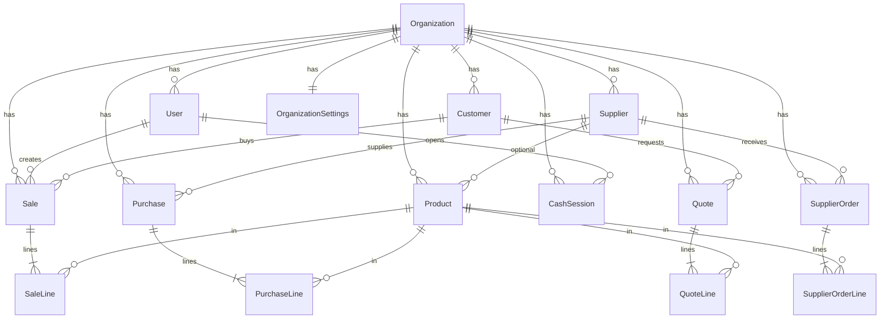

# Esquema de base de datos (Punto Flow)

Documentación lógica del modelo de datos. La **fuente de verdad** del esquema es siempre:

- `apps/api/prisma/schema.prisma`

## Copia congelada para migraciones (p. ej. Supabase)

Tras cada cambio en `schema.prisma`, el repositorio incluye una copia en:

- [`snapshots/schema.prisma`](snapshots/schema.prisma)

Se actualiza automáticamente al ejecutar `npm run db:push` en la API (al finalizar `prisma db push`). También puedes forzarla:

```bash
npm run db:snapshot-schema
```

Mantén este snapshot en git cuando cambies tablas o relaciones; servirá como referencia al pasar a **PostgreSQL** (Supabase) y al rediseñar tipos (`cuid` → `uuid`, `Float` → `double precision`, etc.).

## Motor actual y futuro

| Ahora | Objetivo típico en Supabase |
|-------|------------------------------|
| SQLite (`DATABASE_URL` archivo local) | PostgreSQL gestionado |
| IDs `cuid()` string | Se puede mantener `cuid()` o migrar a `uuid()` |
| `Float` en importes/cantidades | `Decimal`/`double precision` según precisión deseada |
| `OrganizationSettings.generalJson` / `invoiceJson` | `Json` o `jsonb` en Postgres |

## Modelos y relaciones (resumen)



## Tablas (propósito breve)

| Modelo | Rol |
|--------|-----|
| `Organization` | Tenant / negocio (slug único, moneda, datos fiscales). |
| `User` | Usuarios por org (`username` único por org, rol, hash bcrypt). |
| `Product` | Catálogo: SKU único por org, precios 1–4, stock, tipo (PRODUCTO/SERVICIO/INSUMO), granel. |
| `Customer` | Clientes; `code` usado en POS (ej. `0` consumidor final). |
| `Supplier` | Proveedores. |
| `Sale` + `SaleLine` | Ventas POS: términos de pago, totales, líneas. |
| `Purchase` + `PurchaseLine` | Compras / entrada mercancía. |
| `CashSession` | Apertura/cierre de caja por usuario. |
| `Quote` + `QuoteLine` | Cotizaciones / preventas. |
| `SupplierOrder` + `SupplierOrderLine` | Pedidos a proveedor. |
| `OrganizationSettings` | JSON general (favoritos táctil, etc.) y plantilla factura. |

## Datos de ejemplo (`npm run db:seed`)

El seed crea la organización `demo`, usuarios **ADMIN** / **CAJERO**, ~40 productos, clientes, proveedores, ventas factura `DS-240001`…`DS-240015`, compras `SEED-PO-*`, cotizaciones, pedidos proveedor y turnos de caja de prueba. Es **idempotente** (no duplica ventas/compras si ya existen las claves `invoiceNumber` / `reference` / notas marcadas).

---

*Última referencia de esquema Prisma: ver archivo en `docs/snapshots/schema.prisma` (sincronizado con `apps/api/prisma/schema.prisma`).*
